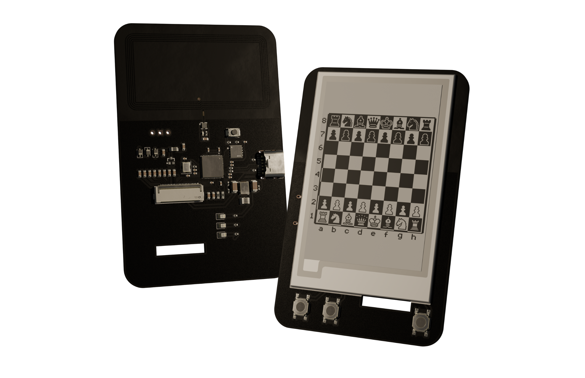
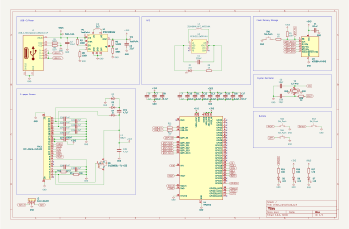
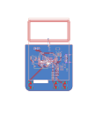
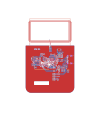
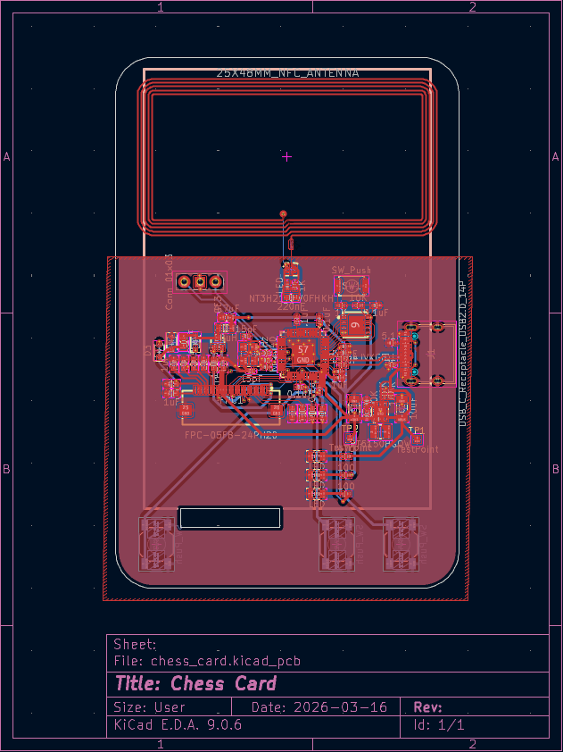
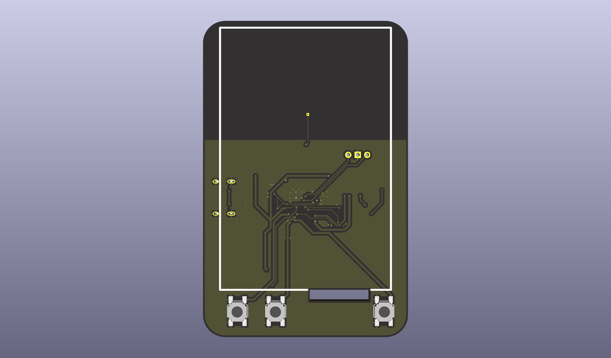
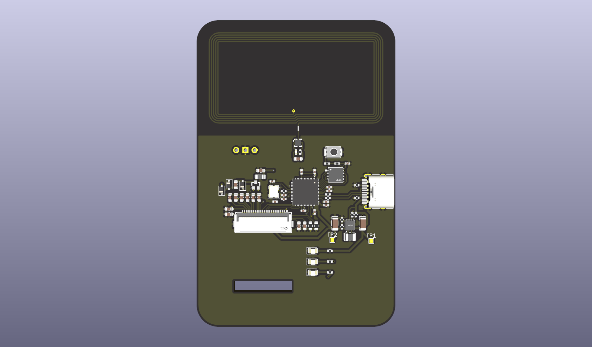

# Pico Gameboy
Ever think of playing chess on the size of a business card? Welcome to the Pico Chess Card!

After building my Tic-Tac-Toe business card, I decided to build a more advanced version that allows users to play chess, compete online through radio, and even compete against AI!

https://github.com/user-attachments/assets/676e2b21-aca0-44f8-8b26-b48a64608b89

# Features
- Pass-and-play mode (like one device but two people take turn)
- Online 1v1 through nrf24l01 (*Will be added in V2!)
- NFC tap to either go to websites or pairing mode

# Components
- RP2040
- 12MHz Crystal (ABM8-272-T3)
- 8MB Flash Storage (W25Q64JVXGIQ)
- Buck-Boost Switching Regulator (RT6150B)
- USB-C (TYPE-C-31-M-12)

# PCB Designs
- 2 layers
- Single-sided component placement
- 2.6mm board thickness
- HASL (with lead) surface finish
- 1oz outer copper weight

## PCB Schematic

## PCB Layouts

## 3D Model

# How to order
- Download the zip file
- Upload the zip file to JLCPCB
- Select PCBA and continue
- Upload BOM.csv and position.csv
- Select the parts and submit payment
